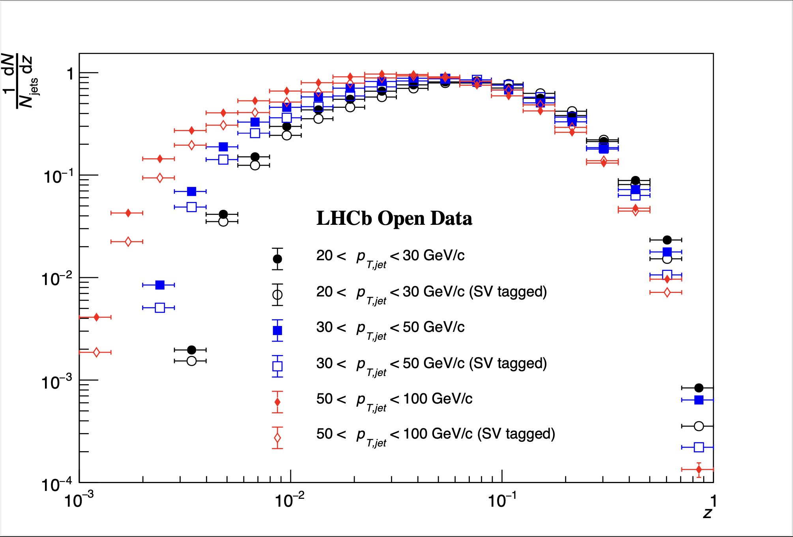

# jet-fragmentation
Example analysis of jet fragmentation functions using LHCb open data. This repository analyzes two sets of ntuples produced using the LHCb Ntupling Service with 2015-2017 data:

1. dijet candidates
    - The dijet candidates are selected from the electroweak (EW) data stream using the stripping line `StrippingFullDiJetsLine`. An example of the configuration of this line for the 2017 data taking period can be found [here](https://lhcbdoc.web.cern.ch/lhcbdoc/stripping/config/stripping29r2/ew/strippingfulldijetsline.html).
2. SV-tagged dijet candidates
    - The SV-tagged dijet candidates are selected from the B hadron complete event (BHADRONCOMPLETEEVENT) data stream, using the stripping line `StrippingTaggedJetsJetPairLineExclusiveDiJet`. An example of the configuration of this line for the 2017 data taking period can be found [here](https://lhcbdoc.web.cern.ch/lhcbdoc/stripping/config/stripping29r2/bhadroncompleteevent/strippingtaggedjetsjetpairlineexclusivedijet.html).

The naming scheme of the columns within the ntuples are the same for both datasets. To inspect the columns in the produced ntuples, a script `inspect_columns.C` is included in the repository. It looks at one file from the dijet dataset and prints the corresponding columns in the ntuple. Since the columns are the same for all files in the dataset, as well as the SV-tagged dijet dataset, this is sufficient to understand the columns available in both datasets. The script can be run with the following command:

```
root -l -b -q inspect_columns.C
```

The dijet candidate is labeled as `H_10` in all corresponding columns in the ntuple. Information is available for the dijet candidate kinematics and geometry. Similarly, the jet candidates are labelled `CELLjet` and `CELLjet_0` for the first and second jet in the dijet candidate in all corresponding columns in the ntuple. Information is available for the jet kinematics and geometry, as well as constituent kinematics, geometry, and PID probabilities / hypotheses. Furthermore, information used to dertermine if the jet is tagged with a reconstructed secondary vertex, and boosted decision tree (BDT) scores for the separation of heavy and light jets, as well as the separation of beauty and charm jets for flavor tagging. The columns for the BDT scores are labelled as `_BDTTag_bdt0` and `_BDTTag_bdt1` for BDT(bc|udsg) and BDT(b|c), respectively. In the SV-tagged dijet sample, both jets in the dijet candidate are tagged to contain a reconstructed secondary vertex. More information on the flavor tagging algorithms used in these datasets can be found in [JINST 10 (2015) 06, P06013](https://inspirehep.net/literature/1365284).

## Jet Fragmentation Function (JFF) Example Analysis

This repository provides separate scripts for analyzing a single jet in the dijet candidate sample, and analyzing a single jet in the SV-tagged dijet candidate sample. In both cases, the collinear jet fragmentation functions are extracted, as well as the transverse momentum with respect to the jet axis ($j_{T}$) and the radial profile of hadrons within the jet ($\Delta R(\rm{hadron}, \rm{jet})$). More specifically, the variables are defined as

$$z = \frac{p_{\rm{hadron}} \cdot p_{\rm{jet}}}{|p_{\rm{jet}}|^{2}}$$

$$j_{T} = \frac{p_{\rm{hadron}} \times p_{\rm{jet}}}{|p_{\rm{jet}}|}$$

$$r = \Delta R(\rm{hadron, jet}) = \sqrt{(\eta_{\rm{hadron}} - \eta_{jet})^{2} + (\phi_{\rm{hadron}} - \phi_{\rm{jet}})^{2}}$$

The scripts produce distributions for $z, j_{T}$, and $r$ both integrated over the range 20 < $p_{T,jet}$ < 100 GeV/c, and in separate $p_{T,jet}$ bins of 20-30, 30-50, and 50-100 GeV/c for charged hadrons within jets in the data sample. They also produce distributions for proton, kaon, and pion PID probabilities for charged particles corresponding to proton, kaon, and pion mass hypotheses. The script to analyze the dijet candidate dataset is titled `JFF.C` while the script to analyze the SV-tagged dijet candidate dataset is titled `JFF_tagged.C`. They can be ran as follows:

```
root -l -b -q JFF.C
root -l -b -q JFF_tagged.C
```

This will produce the PDFs shown in the `output` and `output/tagged` directories, as well as a `.root` file containing the histogram content in both the `output` and `output/tagged` directories, respectively. The scripts `JFF.C` and `JFF_tagged.C` are setup to stream and process the dataset via `xrootd` and multithreading. Currently only one file from the file list is not commented out such that the scripts can be run in a reasonable amount of time (typically 5-10 minutes depending on available cores and network bandwidth). To process the full dataset, the full file list will need to be included by removing the comment blocks. To speed up processing, files can be downloaded locally and the file list can be replaced with paths to local copies of the root files. Please note that in this case, certain lines in the scripts related to optimizing the `xrootd` configuration may need to be removed as well. 

The resulting histograms produced for the dijet candidates and SV-tagged dijet candidates can be compared using the `JFF_compare.C` script. This plots the collinear JFF ($1/N_{jets} dN/dz$) from both samples on the same canvas for comparson. An example of this plot from processing a single data file in both datasets is shown below.

[](output/compare/hz_tagged_compare.pdf)